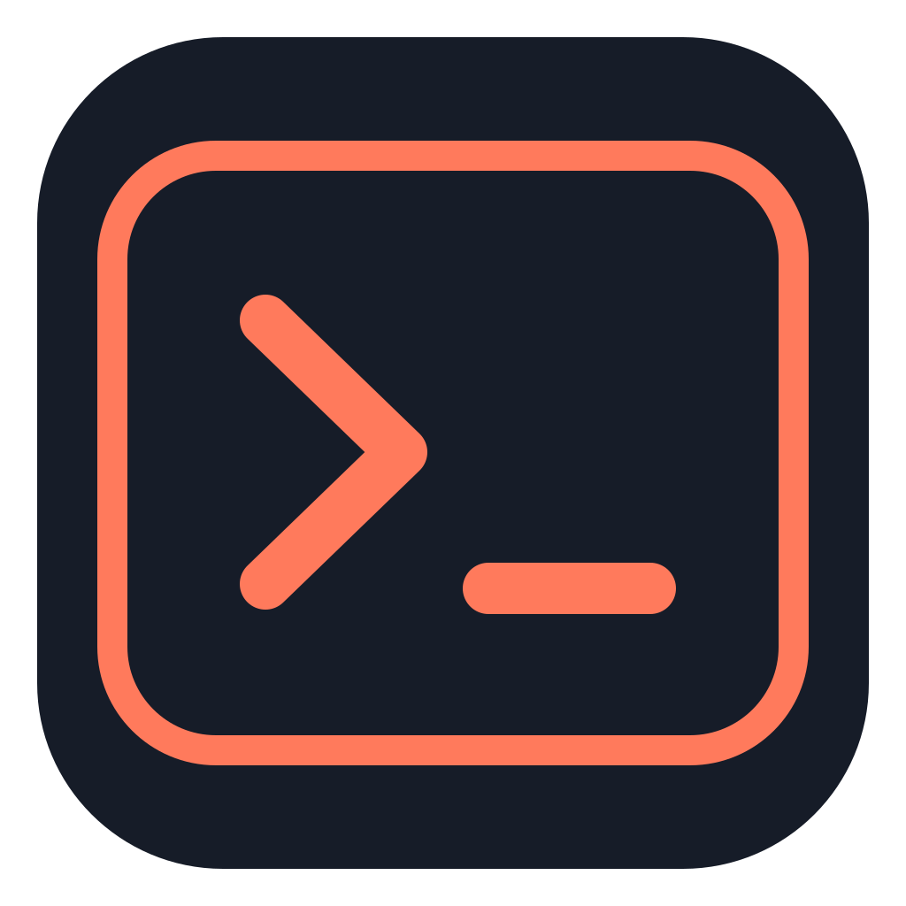
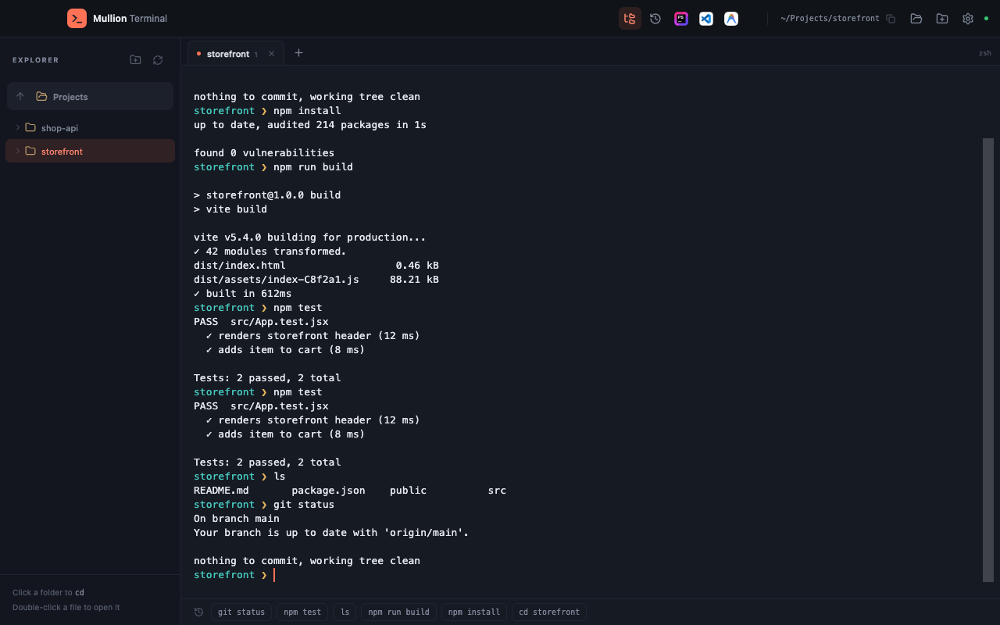
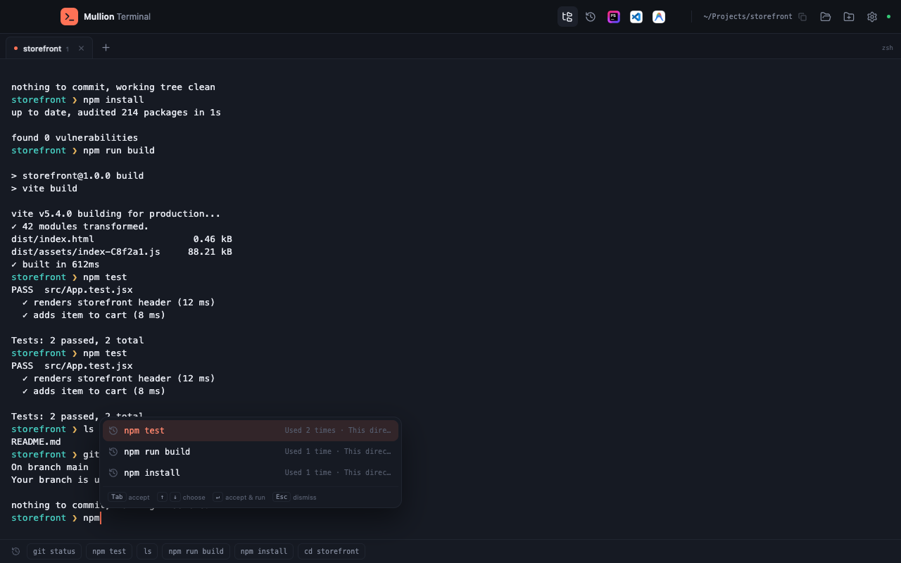
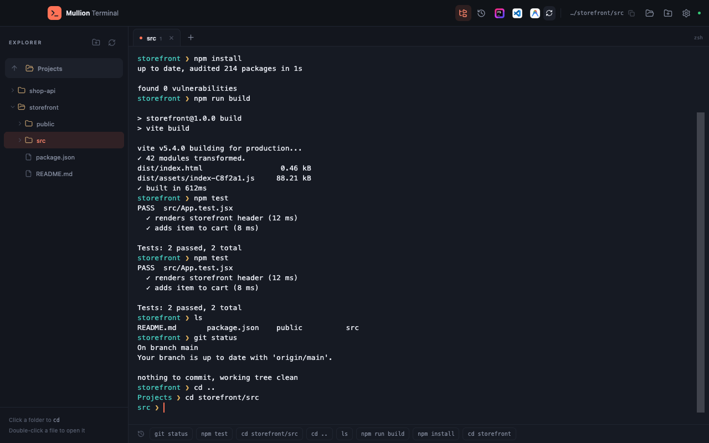
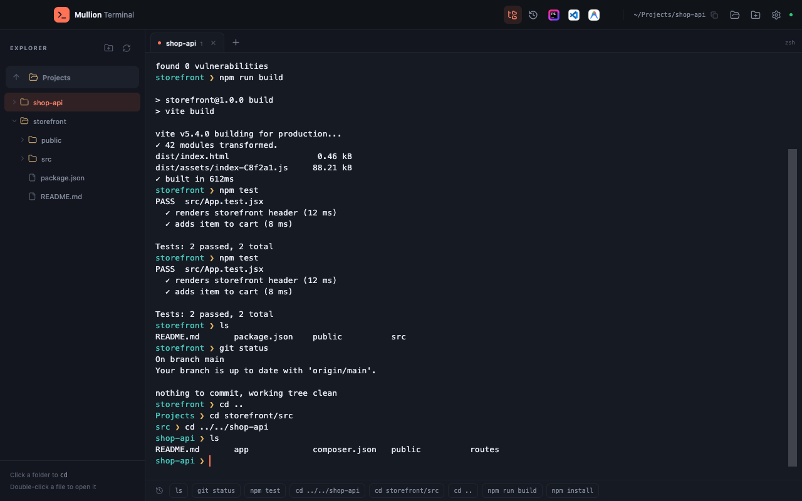
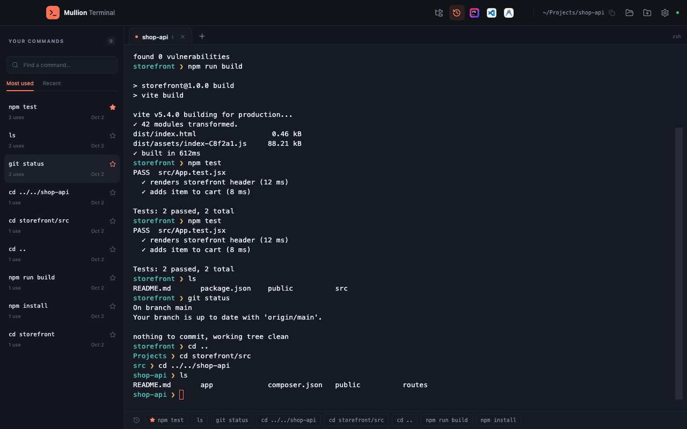
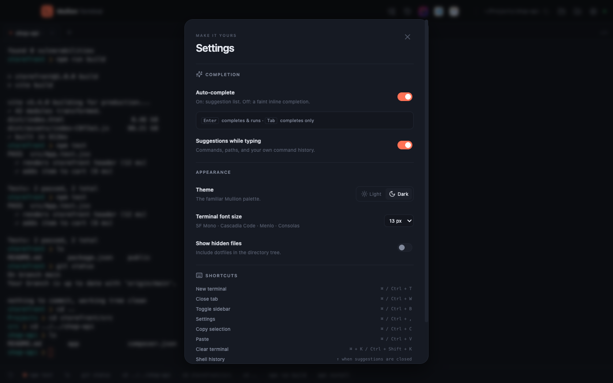
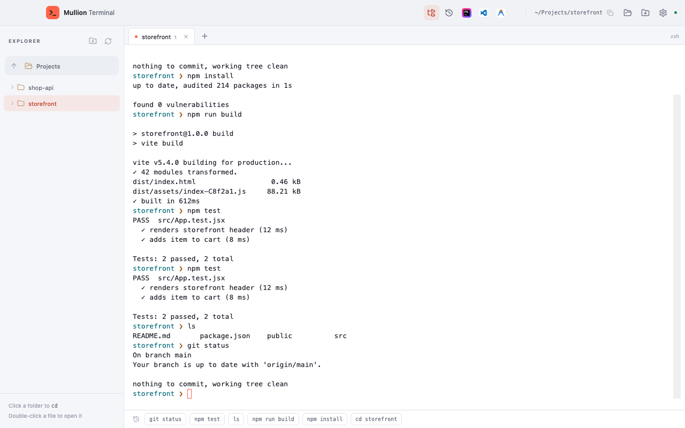
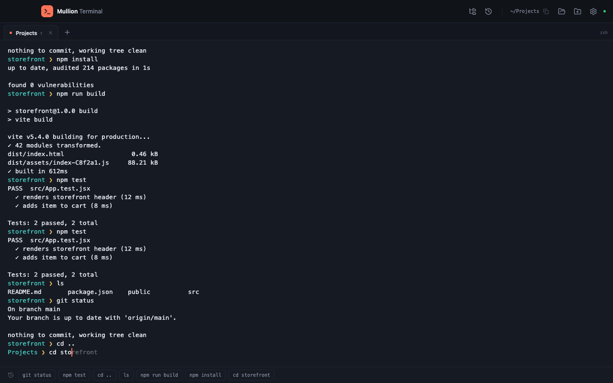

<p align="center">
  
</p>

<h1 align="center">Mullion Terminal</h1>

<p align="center">
  <strong>A standalone desktop terminal with Mullion's familiar look.</strong><br>
  Local command learning, a directory sidebar, and one-click editors — for macOS, Windows and Linux.
</p>

<p align="center">
  <a href="https://github.com/anabiiil/mullion-terminal/releases/latest"></a>
  
  <a href="LICENSE"></a>
</p>

<p align="center">
  <a href="#install">Install</a> ·
  <a href="#features">Features</a> ·
  <a href="#keyboard-shortcuts">Keyboard shortcuts</a> ·
  <a href="https://github.com/anabiiil/mullion-terminal/wiki">Wiki</a> ·
  <a href="CHANGELOG.md">Changelog</a>
</p>

<p align="center">
  
</p>

Mullion Terminal is a real interactive shell in a window that looks and feels like [Mullion](https://github.com/anabiiil/mullion), the author's local dev environment. Every tab runs your actual zsh, bash or PowerShell session — not an emulation — with suggestions learned from your own history, a directory tree that changes folders without restarting the shell, and one click into the editor or IDE that matches the project you're in.

## Why

- **It's your shell, not a wrapper.** Tabs run a real zsh/bash/PowerShell process through [node-pty](https://github.com/microsoft/node-pty). Interactive programs, resizing, and normal shell editing all work as expected.
- **It learns from you, locally.** Suggestions blend commands you've typed before with paths and filenames from the current directory. Nothing leaves the device.
- **The sidebar doesn't interrupt the shell.** Clicking a folder changes directory quietly, in the same session — scrollback, shell variables and pending input stay put.
- **The right editor, one click away.** Open the current folder in VS Code, a JetBrains IDE, Xcode and more — icons appear only when the folder looks like a coding project.

## Features

<p align="center">
  
</p>

**Terminal & tabs**
- The terminal fills the window beneath a compact titlebar; no separate "terminal" panel inside a bigger app.
- The `+` button and the new-tab shortcut (`Cmd+T` on macOS, `Ctrl+Shift+T` on Windows/Linux) open a new, independent tab at your home directory.
- A compact path chip in the titlebar shows the current folder; click it to copy the absolute path.
- The adjacent folder button opens the current directory in Finder, File Explorer or the Linux file manager.
- An **Open folder** button lets you start or move a tab to any directory.

**Suggestions & auto-complete**
- Suggestions combine shell commands, filesystem paths, and commands you've previously run in this app.
- A slim "Most used" row along the terminal's bottom edge keeps your most-used and pinned commands within reach, even before you've built any history.
- With **auto-complete on**, a suggestion list appears near the prompt; with it **off**, the best match appears as faint inline ghost text instead. See [Suggestions & auto-complete](#suggestions--auto-complete) below.

<p align="center">
  
</p>

**Directory tree**
- A sidebar (closed by default; `Cmd+B` / `Ctrl+Shift+B` or the Files icon toggles it) shows a folder tree.
- Clicking a folder (its name or the chevron) expands or collapses it — it never changes directory.
- Double-clicking a folder changes directory in the same shell session, quietly, and makes sure it's expanded.
- Typing `cd` in the shell selects that directory in the tree and expands its ancestors.
- Clicking a file selects it in the tree. Double-clicking a file opens it with `nano` in the active shell (macOS/Linux) or the system's default application (Windows) — this is never saved to command history, since it's the app opening the file, not something you typed.
- Double-clicking a Markdown file (`.md`, `.markdown`, `.mdx`) opens a rendered preview over the terminal instead — headings, lists, tables, code blocks and images included. **Edit** switches to `nano` (or the default application on Windows), **Open externally** hands the file to the system's default app, and `Esc` or the close button returns to the shell. Web and `mailto:` links open in your browser or mail app; links to other Markdown files open in the same preview.

<p align="center">
  
</p>

**Editors & IDEs**
- Coding folders show installed editor icons in the titlebar: hover for the name, click to open the current folder.
- General-purpose editors (VS Code, Cursor, Antigravity, VSCodium, Zed, Sublime Text) appear for any detected project; specialized IDEs only appear when their language matches.
- Ordinary folders — like your home directory — never show editor icons, and a folder doesn't inherit editors from unrelated projects nested inside it.
- A refresh button rescans installed editors after you install a new one.

<p align="center">
  
</p>

**Command history**
- The History sidebar lists every saved command, with search, and sorting by most-used or most-recent.
- Pin commands to keep them at the top and in the quick-commands bar.
- Clicking a command fills the prompt without running it.
- Delete any single command with the trash icon next to its pin star (shown on hover, or always when the row has keyboard focus), or with Delete/Backspace while a command button is focused. Right-clicking a command in the bottom quick-commands bar opens a small menu with the same Pin/Unpin and Remove from history actions. Deleting shows a brief "Removed · Undo" toast to bring it back. This only affects Mullion's own learned history and suggestions — it never touches your shell's native history file (e.g. `~/.zsh_history`), so pressing the Up arrow in the shell still recalls your shell's own history as usual.
- Internal navigation commands from clicking the folder tree, and files the tree opens with `nano` on a double-click, are never saved, and any already saved from an older release are purged automatically on startup.
- Basic, routine commands — `cd`, `ls`, `rm`, `cp`, `mv`, `cat`, `nano`, `clear`, `exit`, their PowerShell equivalents, and the like — stay out of the history sidebar and quick-commands bar. They're still kept in history to improve suggestions while typing, except `cd`/`pushd`/`popd` and their PowerShell equivalents, which are never offered as a learned suggestion (folder-name completion right after typing `cd ` is unaffected — it reads the current directory live, not history).
- A command that fails the first time you run it — a typo like `git psuh` or `brew upgrde`, or one the shell reports as "command not found" or "permission denied" — is never learned as a new entry. Once a command has succeeded at least once, a later failed run still updates its use count and last-used time, so it doesn't drop out of your history. Stopping a long-running command on purpose (`Ctrl+C`, or closing its process) still counts as learned, same as a normal exit.

**Editing files with nano and vim**
- Running `nano` or `pico` gets mouse support automatically: click anywhere in the buffer to place the cursor, and scroll with the mouse wheel to move around a long file. Option/Alt+drag still selects text to copy; nano's own mark (`Ctrl+^`) selects text to cut instead.
- A small **Save / Save & Exit / Exit** bar appears at the bottom-right of the window while nano/pico is running, alongside `Cmd+S` / `Ctrl+S` to save without leaving the keyboard.
- Opt out with the environment variable `MULLION_EDITOR_MOUSE=0`; your own `nano`/`pico` alias or shell function always takes precedence.
- `vim`, `vi` and `nvim` get their own bar with **Save & Close** (`:wq`) and **Close** (`:qa!`) — handy for the commit/rebase/merge message editor that `git pull`, `git commit` and `git rebase` open, so you're not stuck typing `:qa!` to get out of one. `Cmd+S` / `Ctrl+S` saves (`:w`) without closing.

<p align="center">
  
  
</p>

**Settings & appearance**
- Light and dark themes, in Mullion's palette.
- Adjustable terminal font size, and a toggle to show hidden files in the tree.
- Learning stays on this device — see [Where data is stored](#where-data-is-stored).

## Install

Download the latest build from **[Releases](https://github.com/anabiiil/mullion-terminal/releases/latest)**.

### macOS

Download `Mullion-Terminal-<version>-mac-arm64.dmg` (Apple Silicon), open it, and drag **Mullion Terminal** to the Applications shortcut.

The app isn't code-signed or notarized, so the first launch needs one extra step. Either:

- Open it once; when macOS says it can't verify the app, click **Done**, then go to **System Settings › Privacy & Security** and click **Open Anyway** (on older macOS versions, right-click the app in Applications and choose **Open** instead), or
- Clear the quarantine flag from a terminal:
  ```sh
  xattr -dr com.apple.quarantine "/Applications/Mullion Terminal.app"
  ```

### Windows

Download `Mullion-Terminal-<version>-win-x64.exe` and run it. It's an NSIS installer that lets you choose the install directory.

The installer isn't signed, so Windows SmartScreen may show **Windows protected your PC** the first time. Click **More info**, then **Run anyway**.

### Linux

- **AppImage:** download `Mullion-Terminal-<version>-linux-x86_64.AppImage`, make it executable, then run it:
  ```sh
  chmod +x Mullion-Terminal-*-linux-x86_64.AppImage
  ./Mullion-Terminal-*-linux-x86_64.AppImage
  ```
- **Debian/Ubuntu (.deb):** download `Mullion-Terminal-<version>-linux-amd64.deb` and install it:
  ```sh
  sudo apt install ./Mullion-Terminal-*-linux-amd64.deb
  ```

## Open with Mullion Terminal

Right-clicking a file or folder can open it straight into Mullion Terminal: a folder opens a new tab there, and a file opens a new tab in its parent folder with the file opened the same way double-clicking it in the sidebar does (Markdown in the preview, everything else in `nano`). Dropping a file or folder on the app also works. Mullion Terminal never becomes the default app for anything — it only ever appears as an extra option.

- **macOS:** right-click any file or folder in Finder and choose **Quick Actions ▸ Open in Mullion Terminal** (also under **Services**). This works for every file and folder, whatever its type; the app installs it for the current user at `~/Library/Services` on launch, and you can turn it off in Settings. **Open With ▸ Mullion Terminal** is also offered for text and source files (plain text, Markdown, JSON, YAML, XML, HTML, CSS, logs, shell/Python/PHP/JavaScript scripts, C/C++/Swift sources, Makefiles) and for folders — the app claims those specific types rather than every file, since Finder hides apps that claim everything from **Open With**. Dropping a file or folder on the Dock icon always works too.
- **Windows:** right-click a file, or a folder, or empty space inside a folder, and choose **Open with Mullion Terminal** — the installer adds this to the right-click menu for the current user.
- **Linux:** most file managers show **Open With ▸ Mullion Terminal** for any file, including from the AppImage, once it's been run at least once.

You can also open a specific path from the command line, e.g. `mullion-terminal ~/code/project`.

## Quick start

```sh
npm ci
npm run dev
```

`npm run dev` starts the desktop app with its Vite development server. The app opens with one tab already running at your home directory.

- `Cmd+T` (macOS) / `Ctrl+Shift+T` (Windows/Linux) — open a new tab at Home
- `Cmd+B` (macOS) / `Ctrl+Shift+B` (Windows/Linux) — toggle the Files sidebar
- Double-click a folder in the sidebar to change into it (single-click just expands it), or type `cd` in the shell to select it there
- Start typing a command to see suggestions; `Tab` accepts, `Enter` runs

## Suggestions & auto-complete

<p align="center">
  
</p>

Toggle **Auto-complete** in Settings to switch between two modes:

| | Auto-complete **on** | Auto-complete **off** |
| --- | --- | --- |
| Display | A suggestion list appears near the prompt | A single best match appears as faint inline ghost text — no popup |
| `Tab` | Accepts the highlighted suggestion, without running it | Accepts the inline text |
| `Enter` | Accepts the highlighted suggestion **and runs it** | Runs exactly what you typed |
| `↑` / `↓` | Choose a different suggestion | Not used — shell history, once suggestions are closed |
| `Esc` | Dismiss the suggestion list | Dismiss the inline suggestion |
| Empty history, filesystem commands (`cd`, `rm`, `ls`, `cat`, `cp`, `mv`, …) | Waits for a filename prefix before suggesting operands | Suggests files or folders from the current directory immediately, even with nothing typed yet |

In both modes, suggestions blend your command history (ranked by frequency and recency, with pinned and current-directory commands first) with filesystem paths and shell commands. `cd`, `pushd`, `popd` and their PowerShell equivalents are never suggested from history — folder-name completion after typing `cd ` still works, from the live directory listing rather than something you ran before.

## Keyboard shortcuts

| Action | macOS | Windows / Linux |
| --- | --- | --- |
| New terminal tab | `Cmd+T` | `Ctrl+Shift+T` |
| Close active tab | `Cmd+W` | `Ctrl+Shift+W` |
| Toggle Files sidebar | `Cmd+B` | `Ctrl+Shift+B` |
| Settings | `Cmd+,` / `Ctrl+,` | `Ctrl+,` |
| Copy selected terminal text | `Cmd+C` / `Ctrl+C` (with a selection) · `Ctrl+Shift+C` (always) | `Ctrl+C` (with a selection) · `Ctrl+Shift+C` (always) |
| Paste | `Cmd+V` (always) · `Ctrl+V` (at the shell prompt) · `Ctrl+Shift+V` (always) | `Ctrl+V` (at the shell prompt) · `Ctrl+Shift+V` (always) |
| Save (nano/pico/vim in the foreground) | `Cmd+S` / `Ctrl+S` | `Ctrl+S` |
| Clear terminal scrollback | `Cmd+K` / `Ctrl+Shift+K` | `Ctrl+Shift+K` |
| Accept suggestion | `Tab` | `Tab` |
| Dismiss suggestions | `Escape` | `Escape` |
| Shell history, with suggestions closed | `↑` / `↓` | `↑` / `↓` |

Plain `Ctrl+T`, `Ctrl+W` and `Ctrl+B` are left for the shell and full-screen editors (e.g. readline/ZLE word navigation, nano's own bindings) — on Windows and Linux the app's own tab and sidebar shortcuts use `Ctrl+Shift` instead. `Ctrl+C` keeps the shell's normal interrupt behavior when nothing is selected — it only copies when there's a selection (including inside nano/vim). `Ctrl+V` pastes at an idle shell prompt, but a full-screen program like nano or vim receives it unchanged (nano: next page, vim: visual block); `Cmd+V` and `Ctrl+Shift+V` always paste. Ctrl shortcuts work on every platform, including macOS; `Ctrl+A`, `Ctrl+E`, `Ctrl+U` and unshifted `Ctrl+K` keep their normal shell-editing behavior (readline/ZLE), rather than being captured by the app.

## Editors & IDEs

Coding folders show installed editor icons in the titlebar, detected by scanning the folder (two levels deep) for recognizable source files and project manifests. General editors appear for any detected language:

- Visual Studio Code, Cursor, Antigravity, VSCodium, Zed, Sublime Text

Specialized IDEs appear only when their language is present:

- PyCharm, WebStorm, PhpStorm, IntelliJ IDEA, Rider, CLion, GoLand, RustRover
- Xcode (macOS only), Android Studio
- Visual Studio (Windows only)

Discovery looks in the usual install locations for each platform — macOS `/Applications` and app bundles, Windows Program Files and JetBrains Toolbox, Linux `PATH` and common install directories — and the refresh button rescans on demand.

## Settings

Open Settings with the gear icon or `Cmd/Ctrl+,`:

- **Auto-complete** — popup suggestions vs. inline ghost text (see [above](#suggestions--auto-complete)).
- **Suggestions while typing** — turn suggestions off entirely.
- **Theme** — light or dark, in Mullion's palette.
- **Terminal font size** — 11–20px.
- **Show hidden files** — include dotfiles in the directory tree.
- **Clear history** — removes the app's saved commands (two-step confirmation).

## Where data is stored

Settings and up to 1,000 saved commands are stored locally in `preferences.json`, under Electron's `userData` directory for the app. Each saved command keeps its text, use count, last-used time, directory and pin state. There is no cloud sync and no external shell-history import — everything stays on the device, and **Settings → Clear history** removes it.

## FAQ & troubleshooting

**macOS says the app is damaged or can't be opened.**
The app isn't notarized. Builds before 0.1.6 had an incomplete signature that macOS reports as "damaged" — update to the latest release. For the usual first-launch prompt, use **System Settings › Privacy & Security › Open Anyway**, or run `xattr -dr com.apple.quarantine "/Applications/Mullion Terminal.app"` in a terminal.

**Windows SmartScreen blocks the installer.**
The installer isn't signed. Click **More info**, then **Run anyway**.

**The AppImage won't run on Linux.**
Make sure it's executable: `chmod +x Mullion-Terminal-*.AppImage`. Some distributions also need `libfuse2` installed for AppImages in general.

**Editor icons aren't showing up.**
They only appear for folders that look like coding projects (manifests like `package.json` or `composer.json`, or recognizable source files). Ordinary folders, like your home directory, never show them. If you just installed an editor, click the refresh icon next to the editor buttons.

**Suggestions aren't appearing.**
Check that **Suggestions while typing** is on in Settings. The popup or inline hint only appears once the shell prompt is ready and idle.

**Which shells are supported?**
zsh or bash on macOS and Linux, and PowerShell 7 (or Windows PowerShell as a fallback) on Windows. Shell integration is loaded through temporary configuration files — the app doesn't modify your shell profiles. In PowerShell, PSReadLine's own gray inline predictions are turned off inside the app's tabs, since the app shows its own suggestions there. Fish and `cmd.exe` aren't supported by the current prompt integration.

**Homebrew, `sudo` or my PATH behave differently than in my usual terminal.**
They shouldn't — each tab starts your shell the way Terminal.app does. On macOS, zsh runs as a login shell (`/etc/zprofile` with `path_helper`, then your `.zshenv`, `.zprofile`, `.zshrc` and `.zlogin`), and bash reads `/etc/profile` and the first of `~/.bash_profile`, `~/.bash_login` or `~/.profile`, so `eval "$(/opt/homebrew/bin/brew shellenv)"` and `/etc/paths.d` entries work even when the app is opened from Finder or the Dock. If no locale is set, `LANG` defaults to a UTF-8 locale for your macOS region (falling back to `en_US.UTF-8`). The app's own internal variables are never passed to the shell, while session variables such as `SSH_AUTH_SOCK` are. `sudo` prompts on a real terminal device; what you type at a password prompt is never shown as a suggestion or saved to history. On Windows, PowerShell loads your profiles and inherits the PATH the app was started with — if you just installed something with winget, Scoop or Chocolatey, restart the app so new tabs pick up the updated PATH. Tabs set `TERM_PROGRAM=Mullion-Terminal`.

## Building from source

Requires Node.js 24 and npm. Building the native `node-pty` dependency may need Xcode Command Line Tools on macOS, or Python and a C++ toolchain on Linux. Windows needs no build tools: `node-pty` ships prebuilt Windows binaries, which install and `npm run dist:win` use as they are.

```sh
npm ci              # install dependencies and rebuild native modules
npm run dev          # desktop app + Vite dev server
npm run check        # tests, TypeScript, and a production build
npm run dist:mac     # macOS: DMG and ZIP
npm run dist:win     # Windows: NSIS installer (run on Windows)
npm run dist:linux   # Linux: AppImage and DEB (run on Linux)
npm run screenshots  # regenerate the images in docs/screenshots/
```

Each installer is built on its matching OS, since `node-pty` is a native dependency. Output is written to `release/`.

## Releasing

Pushing a tag of the form `vX.Y.Z` triggers the GitHub Actions workflow, which builds the macOS, Windows and Linux installers and publishes them to a GitHub Release with that tag — the assets land on the **[latest release page](https://github.com/anabiiil/mullion-terminal/releases/latest)**. CI builds are unsigned; production code-signing and notarization are left to whoever distributes a signed build.

## License

[MIT](LICENSE) © 2026 Abdelrahman Nabil

## استخدام سريع

شغّل `npm run dev` لفتح التطبيق. التيرمنال بيملأ النافذة، وأزرار المسار والمجلدات والمحررات والإعدادات في الشريط العلوي. الـ sidebar مقفولة افتراضيًا؛ افتحها من أيقونة الملفات أو سجل الأوامر. الضغطة الواحدة على فولدر بتفتح/تقفل الشجرة من غير ما تغيّر المكان، والدبل كليك عليه يغيّر المجلد بهدوء داخل نفس جلسة الـ shell، و`cd` يحدد المجلد مكانه في الشجرة. الدبل كليك على ملف يفتحه للتعديل بـ nano جوه التيرمنال. زرار `+` يفتح تاب جديدة في الـ Home. لو Auto-complete شغّال بيظهر بوكس اقتراحات وEnter يختار وينفّذ؛ لو مقفول بتظهر تكملة خفيفة في نفس السطر، Tab يقبلها وEnter ينفّذ اللي كتبته. أيقونات المحررات بتظهر حسب ملفات المشروع الحالي، والأوامر الأكثر استخدامًا موجودة في سطر صغير جوّه التيرمنال من تحت خالص. الضغط على أي أمر بيكتبه في سطر الأوامر من غير تنفيذ.

## Related

Mullion Terminal shares its look with [Mullion](https://github.com/anabiiil/mullion), a local PHP & Node development environment by the same author.

